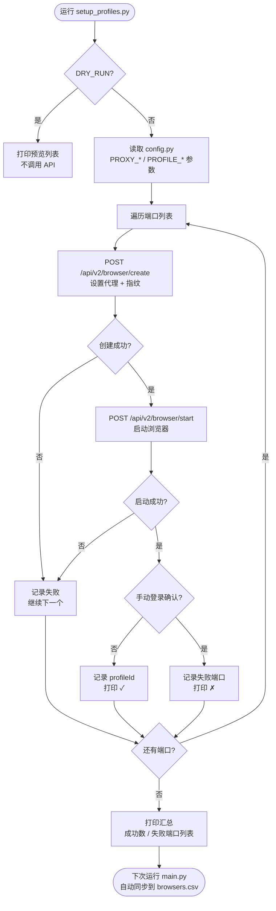
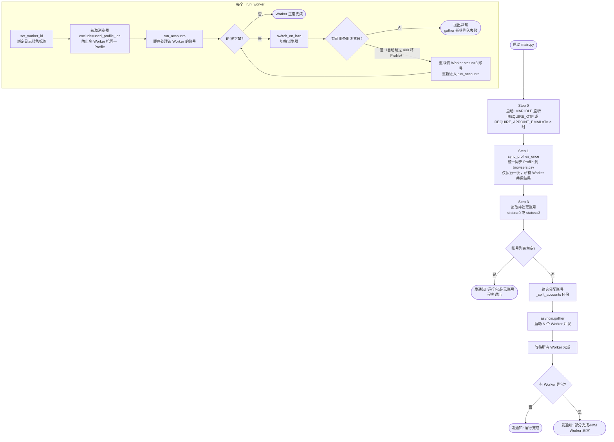
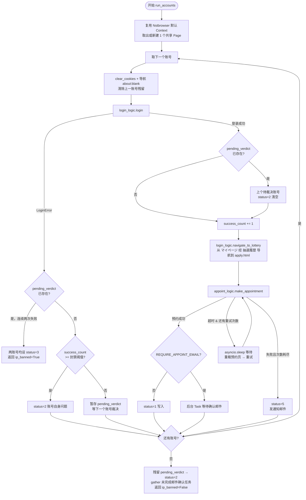
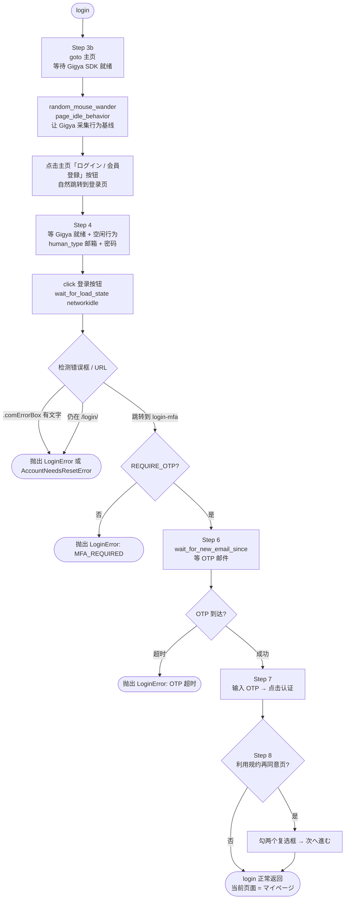
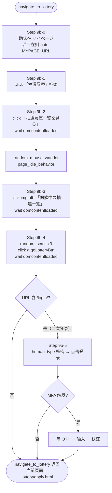
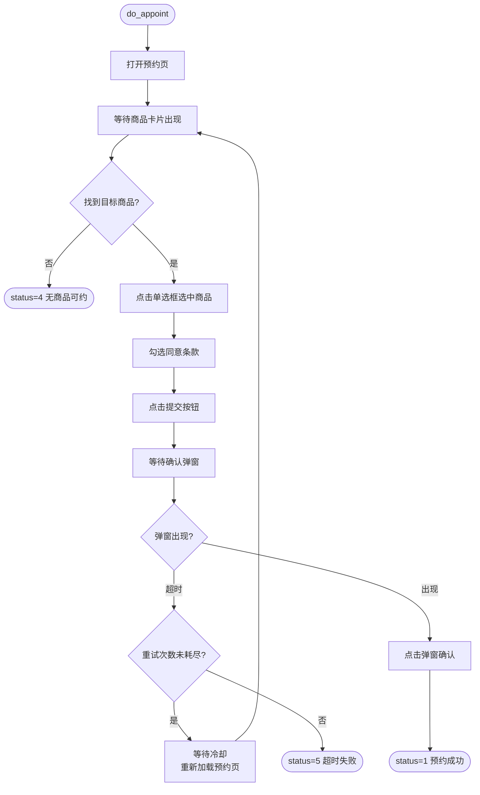
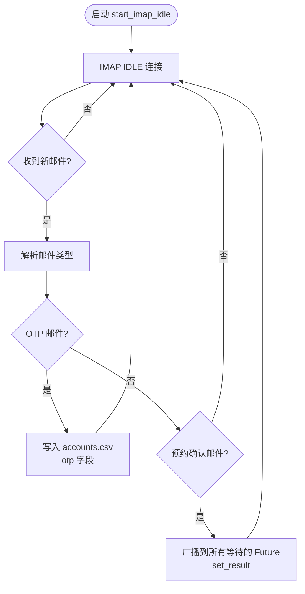

# AutoPokemon — 宝可梦官网自动预约系统

## 项目背景

宝可梦官网抽选预约竞争激烈，手动操作多账号耗时且容易失误。本项目通过 **Nstbrowser 指纹浏览器 + Playwright CDP 自动化**，实现多账号的全自动登录、邮箱验证码获取、预约提交全流程。

支持 **N 路并发 Worker**：每个 Worker 独立持有一个指纹浏览器 + 独立代理 IP，顺序处理分配给自己的那批账号；若 IP 被封禁时自动切换到下一个 Profile 继续，并重试被封账号；程序运行完毕或发生异常时自动发送邮件通知。

---

## 技术选型

| 组件 | 技术 | 说明 |
|------|------|------|
| 指纹浏览器 | Nstbrowser | 提供独立 Canvas/UA/WebGL 等指纹，每个 Profile 绑定不同代理 |
| 浏览器自动化 | Playwright `connect_over_cdp` | 接入现有浏览器实例，不注入 `navigator.webdriver` 等自动化特征 |
| 并发模型 | asyncio `gather` + `ContextVar` | 多 Worker 协程并行，日志自动附加 Worker 标签，单事件循环无线程锁问题 |
| 数据存储 | stdlib `csv` + 原子写入 | 轻量无依赖；`.tmp` 临时文件 + `os.replace` 防数据截断 |
| 通知推送 | smtplib SMTP_SSL | 同一邮箱账号收发，无需额外服务 |
| **Android 直连** | ADB 端口转发 + CDP | `ANDROID_MODE=True` 时跳过 Nstbrowser，直接控制手机 Chrome，复用真实浏览器上下文 |

---

## 项目结构

```
autopokemon/
├── main.py                  # 启动入口：Profile 同步、账号分片、N 路 Worker 并发
├── config.py                # 全局配置（API Key、代理、并发数等）
├── setup_profiles.py        # 一次性批量创建指纹 Profile
├── risk_overlay.py          # 实时风控监控悬浮窗（CDP + JSONL tail，调试期间使用）
├── desk_monitor.py          # 批量运行进度悬浮窗（读 accounts.csv + run_*.log）
├── logs/                    # 运行日志（自动创建）
├── data/                    # 数据文件（自动创建）
│
├── core/
│   ├── browser_factory.py   # Nstbrowser API v2：启动/停止/列出 Profile
│   ├── browser_manager.py   # 浏览器生命周期管理：Profile 同步、初始化、IP 封禁切换
│   └── cdp_handler.py       # Playwright connect_over_cdp 连接生命周期
│
├── modules/
│   ├── login_logic.py       # 登录流程 + 登录后导航到抽選応募一覧（navigate_to_lottery）
│   ├── appoint_logic.py     # 预约流程：找商品 → 单选框 → 同意 → 确认弹窗
│   └── session_runner.py    # 账号循环 + IP封禁状态机 + 邮件确认后台任务
│
└── utils/
    ├── anti_bot.py          # 人类行为模拟：贝塞尔鼠标轨迹、正态分布打字、随机延迟
    ├── data_manager.py      # 数据层唯一入口：accounts.csv / browsers.csv 原子读写
    ├── email_fetcher.py     # IMAP IDLE 监听：OTP → CSV + 预约确认广播唤醒模型
    ├── logger.py            # 控制台着色（多 Worker 分色）+ 文件双输出
    └── notifier.py          # SMTP 通知：程序退出时发邮件
```

**数据目录（运行时自动创建）：**

```
data/
├── accounts.csv         # 账号数据（手动维护）
├── browsers.csv         # 浏览器数据（自动维护）
└── emails.csv           # 邮件缓存（IMAP IDLE 自动写入 OTP 记录）

logs/
└── run_YYYYMMDD_HHMMSS.log
```

**架构原则：**

- `data_manager.py` 是读写 CSV 的**唯一**模块，其他模块禁止直接操作文件
- `core/` 只负责**基础设施**（浏览器连接），不含业务逻辑
- `modules/` 只负责**业务流程**，不感知浏览器如何启动
- `utils/` 提供**无状态工具**，不依赖业务模块

---

## 并发架构

```
main()
 ├─ sync_profiles_once()          ← 启动前统一同步一次 Nstbrowser Profile，所有 Worker 共用
 │
 ├─ _split_accounts(accounts, N)  ← 轮询分配：acc1→W1, acc2→W2, acc3→W1, ...
 │
 └─ asyncio.gather(               ← N 个 Worker 并发运行，return_exceptions=True
      _run_worker(1, [acc1,acc3,...]),    ← 独立 Browser A + 代理 IP-A
      _run_worker(2, [acc2,acc4,...]),    ← 独立 Browser B + 代理 IP-B
      ...
   )

每个 _run_worker(id, accounts) 内部：
  set_worker_id(id)               ← 该 Task 内所有日志自动加 [W{id}] 前缀
  acquire_browser(exclude=used)   ← 加锁，用 exclude 避免多 Worker 抢同一浏览器
  run_accounts(browser, accounts) ← 在 Worker 内顺序处理账号
  if ip_banned: switch_browser() → retry
```

**日志区分**：控制台为每个 Worker 分配独立 ANSI 颜色（W1=青 W2=黄 W3=绿 W4=洋红 …），日志文件保持纯文本。

**Worker 隔离**：某个 Worker 抛出异常不会取消其他 Worker（`return_exceptions=True`），失败的 Worker 编号会在退出通知邮件中列出。

---

## 运行流程图

### 批量创建指纹环境（setup_profiles.py）



---

### 主流程（main.py）



---

### 账号循环 & IP 封禁状态机（session_runner.py）



---

### 登录 + 导航流程（login_logic.py）





---

### 预约流程（appoint_logic.py）



---

### 邮件系统（email_fetcher.py）



---

## 账号状态机

| status | 含义 | 后续动作 |
|--------|------|----------|
| 0 | 待处理 | 本次运行 |
| 1 | 预约成功 | 跳过 |
| 2 | 账号自身问题（密码错/封号等） | 跳过 |
| 3 | IP 封禁波及，需重试 | 切换 Profile 后重跑 |
| 4 | 无商品可约 | 跳过（下次活动前重置为 0） |
| 5 | 预约超时失败 | 手动确认后重置 |

---

## IP 封禁判定逻辑

```
success_count 记录自上次失败后的连续成功次数，BAN_THRESHOLD = 2（可配置）

登录失败时：
  if pending_verdict 已存在（上次也失败）:
      → 两个账号都标 status=3，返回 ip_banned=True（封禁确认）
  elif success_count >= BAN_THRESHOLD:
      → 暂存 pending_verdict（可能是账号自身问题，等下一个账号裁决）
  else:
      → status=2（账号自身问题，成功次数不足以排除 IP 因素）

登录成功时：
  if pending_verdict 已存在:
      → 上个账号是自身问题，status=2（清空 pending_verdict）
  success_count += 1
```

**多 Worker 说明**：每个 Worker 持有独立的 `pending_verdict` 和 `success_count`，IP 封禁判断在 Worker 内部独立运行，互不干扰。

---

## 邮件系统

采用 **广播唤醒模型**：

- 单一后台协程监听 IMAP IDLE，所有 Worker 共享
- OTP 邮件到达 → 直接写入 `accounts.csv` 的 `otp` 字段，登录逻辑轮询读取
- 预约确认邮件到达 → 遍历所有等待中的 `asyncio.Future`，调用 `set_result()`
- 每个账号预约成功后，session_runner 创建后台 Task 等待 Future，不阻塞主流程

---

## 程序退出通知

| 场景 | 通知内容 |
|------|----------|
| 正常完成，无账号 | 运行完成·无待处理账号 |
| 正常完成 | 运行完成·全部 Worker 正常 |
| 部分失败 | 部分完成·N/M Worker 异常，列出失败 Worker 编号 |
| 未捕获异常 | 程序崩溃·异常信息 |

---

## 快速开始

### 1. 安装依赖

```bash
pip install playwright
playwright install chromium
```

### 2. 配置 config.py

```python
# Nstbrowser API
NST_HOST    = "localhost:8848"
NST_API_KEY = "your_api_key"

# 并发 Worker 数（= 同时使用的指纹浏览器数量）
CONCURRENT_BROWSERS = 2

# 是否需要 OTP 邮箱验证（生产环境必须 True）
REQUIRE_OTP = True

# 是否等待预约确认邮件才标 status=1
REQUIRE_APPOINT_EMAIL = False

# OTP 统一收件邮箱（IMAP 授权码）
OTP_EMAIL_ADDR      = "your_otp@example.com"
OTP_EMAIL_AUTH_CODE = "your_imap_auth_code"

# 邮件通知配置（复用 OTP 邮箱发件）
NOTIFY_TO_EMAIL = "your_notify@example.com"

# IP 封禁判定阈值（连续成功 N 次后才裁定失败为账号自身问题）
IP_BAN_CONFIRM_THRESHOLD = 2

# 预约重试次数和冷却时间（秒）
APPOINT_RETRY_TIMES = 2
APPOINT_RETRY_WAIT  = 60
```

### 3. 创建指纹浏览器 Profile（首次）

```bash
python setup_profiles.py
```

按提示在每个弹出的浏览器中手动登录 Nstbrowser 账号，完成后回车确认。

### 4. 准备账号数据

`data/accounts.csv` 格式：

```csv
username,password,status,error_message
user1@example.com,pass1,0,
user2@example.com,pass2,0,
```

### 5. 运行

```bash
# 主程序（批量预约）
python main.py

# 可选：同时开启实时风控监控悬浮窗（调试 / 采集基线时使用）
python risk_overlay.py --log logs/risk_log.jsonl --change baseline

# 可选：同时开启批量进度悬浮窗
python desk_monitor.py
```

---

## Android 模式（ADB 直连手机 Chrome）

> 适用场景：PC 脚本被风控拦截，而手机浏览器（有大量历史上下文）可以正常通过。  
> 原理：通过 ADB 端口转发将手机 Chrome 的 CDP 接口映射到本地，Playwright 直连控制，完全跳过 Nstbrowser。

### 前提条件

1. 手机开启 **USB 调试**，通过 USB 或 Wi-Fi 连接到 PC
2. 手机 Chrome 已打开（任意页面即可）
3. 手机已开启 VPN，连接到 **IIJ 节点**（AWS/GCP 节点会被站点拦截）

### 启动步骤

**Step 1：建立 ADB 转发**

```powershell
# 确认设备已连接
adb devices

# 将手机 Chrome CDP 端口映射到本机 9222
adb forward tcp:9222 localabstract:chrome_devtools_remote

# 验证（应返回包含宝可梦页面的 JSON 数组）
curl http://localhost:9222/json
```

**Step 2：启用 Android 模式**

在 `config.py` 中修改：

```python
ANDROID_MODE     = True   # 改为 True
ANDROID_CDP_PORT = 9222   # 与 adb forward 的本地端口一致
```

**Step 3：运行脚本**

```bash
python main.py
```

脚本将跳过 Nstbrowser Profile 同步，直接连接 `http://127.0.0.1:9222`，通过 CDP 控制手机 Chrome 完成登录和预约。

### 注意事项

- Android 模式下为**单账号顺序处理**，不支持多 Worker 并发
- 每次手机 USB 重新连接后需重新执行 `adb forward`
- 脚本运行期间请勿手动操作手机 Chrome，避免标签页切换干扰
- 若 `adb forward` 后 `localhost:9222` 无响应，检查手机 Chrome 是否在前台运行

---

## 数据文件说明

### accounts.csv

| 字段 | 说明 |
|------|------|
| username | 账号邮箱 |
| password | 账号密码 |
| status | 账号状态（0-5，见状态机） |
| error_message | 最近一次失败的错误信息（程序自动写入） |

### browsers.csv

| 字段 | 说明 |
|------|------|
| name | Profile 显示名称（从 Nstbrowser API 同步） |
| profile_id | Nstbrowser Profile ID |
| last_launch_time | 最近一次启动时间（用于均衡选择，越早越优先） |
| last_ban_time | 最近一次 IP 封禁时间（冷却期内跳过） |

### emails.csv

| 字段 | 说明 |
|------|------|
| original_sent_at | 邮件原始发送时间 |
| original_received_at | 邮件到达收件箱时间 |
| original_from | 发件人地址 |
| original_to | 收件人地址 |
| otp_code | 解析出的 OTP 验证码 |
| otp_code | 解析出的 OTP 验证码 |

---

## 注意事项

1. **atomic CSV 写入**：`data_manager.py` 使用 `.tmp` 临时文件 + `os.replace()` 原子替换，Ctrl+C 不会导致数据文件损坏
2. **并发 Profile 独占**：`used_profile_ids` 集合在所有 Worker 间共享，`setup_and_acquire` 通过 `exclude` 参数确保每个 Worker 获取不同的指纹浏览器
3. **Profile 同步仅执行一次**：`sync_profiles_once()` 在 `main()` 中调用，Worker 内部跳过同步（`skip_sync=True`），避免重复请求 Nstbrowser API
4. **Worker 日志颜色**：控制台日志按 Worker 编号着色，颜色循环分配；日志文件为纯文本，包含 `[W{id}]` 前缀便于 grep；账号进度以 `账号 X/N` 格式输出，一眼可见剩余数量
5. **账号隔离方式**：同一 Worker 内各账号共用 Nstbrowser 默认 Context 的同一个标签页，每次处理新账号前调用 `clear_cookies()` 清除 Cookie/存储，效果等同独立 Context，且不会产生多余标签页
6. **坏 Profile 自动跳过**：`setup_and_acquire` 和 `switch_on_ban` 内置循环重试逻辑——若某 Profile 启动返回 400（Profile 已失效/被删除），立即写入 `last_launch_time`（降低下次被选优先级）并跳过，继续尝试下一个，直到找到可启动的 Profile 或耗尽所有可用 Profile
7. **Nstbrowser 需保持运行**：程序运行期间请勿关闭 Nstbrowser 客户端
8. **代理稳定性**：建议每个 Profile 绑定独立的住宅代理 IP，避免共享代理
